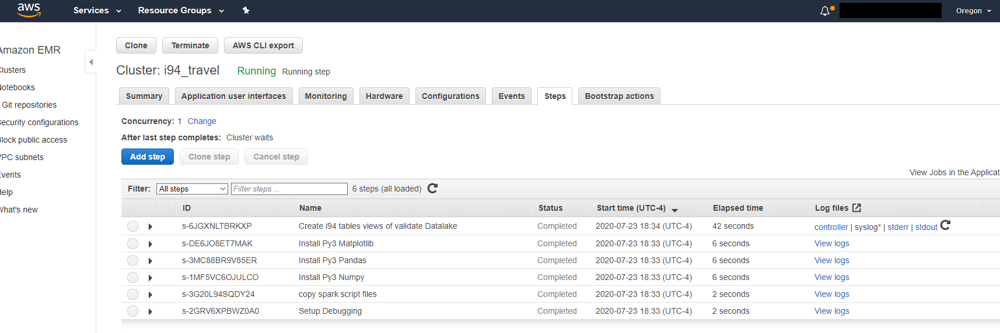
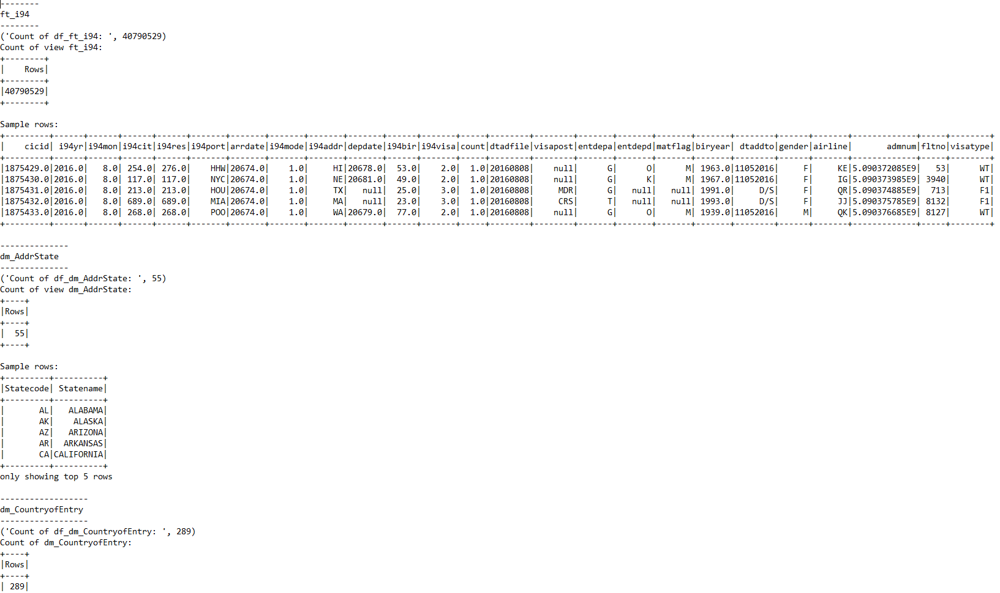
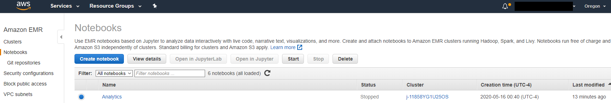
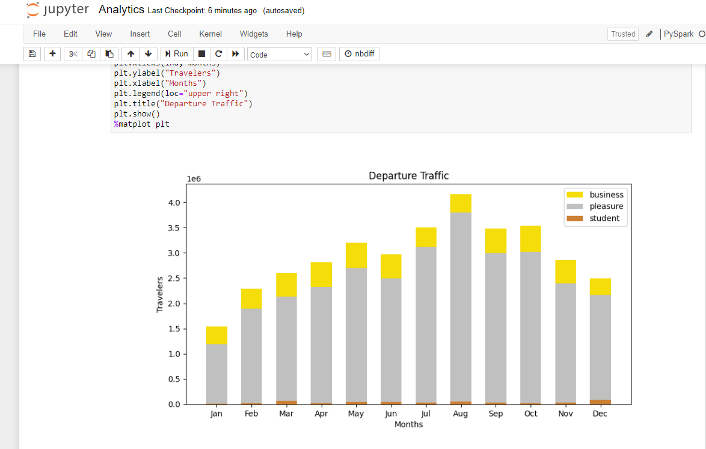

# i94 Data Lake on AWS
#### using EMR, Spark, SparkSQL, Hadoop, Hive, UDF, Boto3, Python, Pandas, Matplotlib, S3

---

### Contents
[Business Requirement](https://github.com/kp-commit/i94/blob/master/README.md#business-requirement)  
[Datasets](https://github.com/kp-commit/i94/blob/master/README.md#datasets)  
[Data Assessment](https://github.com/kp-commit/i94/blob/master/README.md#data-assessment)  
[Data Model](https://github.com/kp-commit/i94/blob/master/README.md#data-model)  
[Data Dictionary](https://github.com/kp-commit/i94/blob/master/README.md#data-dictionary)  
[Solution for i94 Data Lake in AWS cloud](https://github.com/kp-commit/i94/blob/master/README.md#solution-for-i94-data-lake-in-aws-cloud)  
[File Contents and purpose of each file](https://github.com/kp-commit/i94/blob/master/README.md#file-contents-and-purpose-of-each-file)  
[How to Run](https://github.com/kp-commit/i94/blob/master/README.md#how-to-run)

---
### Business Requirement:
- You are working with the Analytics team that needs to look at raw data sources provided and translate the data into a language stakeholders can relate to. 
- For this they need data pipeline that can extract, transform, load from large i94 datasets which comes a variety of data sources (Millions of records).
- Nature of the business requires transformed files to periodicaly updated to shared location readily available to the western regional offices where analytics team is working.
- Records must be kept persistent for durations specified by legal, financial and company mandates. 
- They also need the abilities to do on demand analysis on the large number records as needed quickly without investing in permanent infrastructure.
- Current data resides on site in mount volumes as large SAS files, CSVs, JSON files

 

**Analytics Teams would like to answer following queries with visualizations from the datasets:**
1. What are top 10 cities for US arrivals?
    - Find the top destinations for which main purpose of travel is pleasure?
    - Find the top destinations for which main purpose of travel is pleasure?
    - Find the top destinations for which main purpose of travel is studies?
2. Which countries did travelers come from?
3. Which countries do travelers live in?
4. What are preferred Airlines for travelers coming to US? Which flights are most popular?
5. What is the ratio of Men/Women traveling to/from US?
   - For Business - Men & Women
   - For Pleasure - Men & Women
   - For Studies - Men & Women
6. Visa categories used for travel?
7. From above, where are the most visa issued?
8. Which month of year did most people arrive in? Month of most arrivals?
9. Which month of year did most people arrive in? Month of most arrivals? Total
   - Which month of year did most people arrive in? Month of most arrivals? For Business?
   - Which month of year did most people arrive in? Month of most arrivals? For Pleasure?
   - Which month of year did most people arrive in? Month of most arrivals? For Studies?
10. Which month of year did most people leave/depart in? Month of most depeatures? Total
    - Which month of year did most people leave/depart in? Month of most depeatures? For Business?
    - Which month of year did most people leave/depart in? Month of most depeatures? For Pleasure?
    - Which month of year did most people leave/depart in? Month of most depeatures? For Studies?

 

### Datasets:
---

1. I94 Immigration Data: This data comes from the US National Tourism and Trade Office. [This](https://travel.trade.gov/research/reports/i94/historical/2016.html) is where the data comes from. A few sample data descriptions in SAS labels file but it does not have all the details. You'll need explore and assess the data, make assumptions, document it and move ahead with building your data model based on this. 

2. World Temperature Data: This dataset came from Kaggle. You can read more about it [here](https://www.kaggle.com/berkeleyearth/climate-change-earth-surface-temperature-data).

3. U.S. City Demographic Data: This data comes from OpenSoft. You can read more about it [here](https://public.opendatasoft.com/explore/dataset/us-cities-demographics/export/).

4. Airport Code Table: This is a simple table of airport codes and corresponding cities. It comes from [here](https://datahub.io/core/airport-codes#data).

5. Airline Codes : This is dataset contains information about airlines across the globe. It comes from [OpenFlights Airlines Database](https://openflights.org/data.html)

 

## Data Assessment:
Please open the following Notebooks to see details of assesement done:
- **[Initial_assessment_of_datasets.ipynb](Analytics.ipynb)** - Initial assessment of i94 datasets
- **[Explore_ft_i94](Explore_ft_i94.ipynb)** - Exploring Fact table i94 dataset files, check duplicates, nulls
- **[Explore_Airlines_dat.ipynb](Explore_Airlines_dat.ipynb)** - Exploring airlines_dat file, check duplicates
- **[Explore_Flight_Number.ipynb](Explore_Flight_Number.ipynb)** - Exploring Flight Number file, check duplicates

 

## Data Model:
**Conceptual Data Model**

 

**Logica Data Model Draft**

_(**Note:** Entity relations are shown here. Thought of permanent tables structures in Redshift was under consideration, but was dropped over rapid analysis directly from S3 using Jupyter Notebooks on EMR)_

 

**Physical Data Model:** 

_(**Note:** No relations shown, i.e. no referenital integrity kept. These are temporary tables read directly from S3 in Analytics.ipynb Jupyter Notebook)_

**Why did I choose the model you chose?**
 Main focus of requirements needed quick delivery in EMR. A non relational approach for processing Big Data was needed, both for Storage/Retrieveal (S3) and fast processing (EMR Spark). Columns identified with high null value count were dropped, appropriate columns renamed when needed, and duplicates removed.

 

## Data Dictionary:

 

**Table ft_i94**
 Column   | Definition |
|:---      |:--- | 
cicid     | USCIS Client Identifer | 
i94yr     | 4 digit year | 
i94mon    | 2 digit month | 
i94cit    | Country of Entry (country code) | 
i94res    | Country of Residence (country code) | 
i94port   | Port of Entry (port code) | 
arrdate   | Arrival Date in USA (in SAS date value format) | 
i94mode   | Mode of entry | 
i94addr   | Address in USA during visit, state code | 
depdate   | Departure Date from USA | 
i94bir    | Age of Respondent in Years, 2 digit integer | 
i94visa   | Purpose of visit (code) | 
count     | count, interally used by uscis for summary statistics | 
dtadfile  | Date added to i-94 Files, in YYYYMMDD format | 
visapost  | Place/post of Visa issue | 
entdepa   | Arrival Flag Codes | 
entdepd   | Departure Flag Codes | 
matflag   | Match of arrival and departure records | 
biryear   | 4 digit year of birth in YYYY format | 
dtaddto   | Date admitted to US (allowed to stay till), in MMDDYYYY format | 
gender    | Gender | 
airline   | Airline used to arrive in U.S | 
admnum    | Admission number | 
fltno     | Flight number of Airline used to arrive in U.S. | 
visatype  | Class of admission legally admitting the non-immigrant to temporarily stay in U.S.	|

 

**Table dm_CountryofEntry**
 Column   | Definition |
|:---      |:--- | 
Code | Country Code |
Country |  Name of Country |

 

**Table dm_PortofEntry**
 Column   | Definition |
|:---      |:--- | 
City | City Name |
Code | Port Code |
State | State Name |

 

**Table dm_ModeofEntry**
 Column   | Definition |
|:---      |:--- |
Mode | Mode of Entry Code |
Modetype | Mode Type |

 

**Table dm_AddrState**
 Column   | Definition |
|:---      |:--- | 
Statecode | Code of State | 
Statename | Name of State | 
 
 

**Table dm_Purpose**
 Column   | Definition |
|:---      |:--- | 
Code | Purpose (Visa) Code | 
Purpose | Purpose Type | 
 
 

**Table dm_Airport**
 Column   | Definition |
|:---      |:--- | 
ident | Unique Identifier | 
type | Airport Type | 
name | Name of Aiport | 
elevation_ft |  Elevation in feet | 
continent | continent | 
iso_country | Country as per ISO | 
iso_region | Region as per ISO | 
municipality | municipality/city | 
gps_code | GPS Code | 
iata_code | IATA Code | 
local_code | Local Code | 
coordinates | Coordinates | 

 

**Table dm_airline_name**
 Column   | Definition |
|:---      |:--- | 
id | Unique OpenFlights identifier for this airline. | 
carrier | Name of the airline | 
Alias | Alias of the airline. For example, All Nippon Airways is commonly known as "ANA" | 
code | 2-letter IATA code, if available. | 
ICAO | 3-letter ICAO code, if available. | 
Callsign | Airline callsign. | 
Country | Country or territory where airport is located as per ISO codes | 
Active | "Y" if the airline is or has until recently been operational, "N" if it is defunct. | 

 

**Table dm_CityDemoGraph**
 Column   | Definition |
|:---      |:--- | 
City | City Name | 
State | State Name | 
MedianAge |  Median Age of Population in City | 
Male |  Count of Males residing in City | 
Female | Count of Females residing in City | 
TotalPop | Total Population | 
Veterans |  Count of Veterans residing in City | 
Foreign_born | Count of Foreign born nationals residing in City | 
Avg_Hshld_Size |  Average House Hold size | 
St_cd | State Code | 
Race | Race of Demograph of row idenfitied | 
Count | Count used by Census | 

 

**Table dm_Weather**
 Column   | Definition |
|:---      |:--- | 
dt |  Date | 
AverageTemperature | Average Temperature on date | 
AverageTemperatureUncertainty | Average Temperature of Uncertainty on date | 
City | City | 
Country | Country | 
Latitude | Latitude coordinates | 
Longitude | Longitude coordinates |

 

## Solution for i94 Data Lake in AWS cloud:

Requirements state, that you are working with the Analytics team that needs to look at raw data sources provided and translate the data into a language stakeholders can relate to. For this they need:
- A data pipeline that can extract, transform, load from large i94 datasets which comes a variety of data sources (Millions of records).
- Nature of the business requires transformed files to periodily updated to shared location readily available to the western regional offices where analytics team is working.
- Records must be kept persistent for durations specified by legal, financial and company mandates. 
- They also need the abilities to do on demand analysis on the large number records as needed quickly with investing in permanent infrastructure.
- Current data resides on site in mount volumes as large SAS files, CSVs, JSON files

**What is our goal here? How would Spark or Airflow be incorporated?**
* To deliver a data pipeline that does extract, transform, load from large i94 datasets which comes a variety of data sources. This is done using Spark first to transform and then later to analysis as well. This is because it easily can process large datasets that we have (40+ million records in i94 data and 8+ million in Global Weather data).

**Why choose this model?**
* Use of technologies of Pyspark, EMR, S3 with visualizations using Pandas, Matplotlib meets business requirements.
* Spark with EMR - provides on-demand, high capabilities without much investments. No long term infra investments.
* S3 provides meetings low cost mandates of business, while provding needed records retention for legal and finance.

**Rationale for the choice of tools and technologies for this project:**
* S3 provided durable flexible storgage that meet the legal, financial and company mandates as per requirements.
* Team, doesn want to invest permanent infrastructure. So a combination with S3 with EMR on-demand with large processing capacities on Spark looks to be suitable.
* Local workspace already had Spark, allowing for local process before being transported in compressed format to S3
* As working with large datasets, further processing on EMR and Notebook 'Analytics' attached, allows temp tables directly from S3 giving team instant analysis and visualizations 
* Data pipeline quickly delivers data to team in their regional office us-west-2
* Pandas and Mataplot in combination are used for visualization as they are readily available with EMR for immediate analysis.

**Process steps:** 
* Reference Diagrams Data Models (Conceputal, Logical, Physical) and 'i94 Data Lake in AWS cloud')
Additionally, refer to Jupyter Notebook files: Data_Wrangle_ft_i94_and_Assess.ipynb, Explore_Airlines_dat.ipynb for steps taken.
* We have data pipeline (initiated by etl.py) that does extract, transform, load from large i94 datasets which comes a variety of data sources. This is done using Spark on the local workpsace. As it easily can process large datasets that we have. Using Spark, we transformed data, which is then delivered into S3_stage folder as compressed parquet files suitables for network upload to S3 is done. Further validation is done in EMR (newly created on demand using Lanuch_cluster.py). Analysis is done with provided Jupyter notebook 'Analytics'. The notebook is attached to cluster to run queries (mentioned above) and answer the questions Analytics teams and provide visualizations as need.

**How often the data should be updated and why?**
* The Data pipeline is looking for i94 monthly data in specific SAS folder. For that, we should have updates of same monthly intervals. For other dimensions, could simply have file updates, refreshes to get latest data and saved with same name. The pipeline will process as needed.
* Incase, they are looking at other dimensions (new data sources) or newer data. Additional transforms will need to be defined, added in data pipleine for delivery.
* This largely depended on data growth and team's requirements. Currently, we are looking at historical data (2016) that needs immediate analysis rather than incremental growing data.

**How would the approach be different under the following scenarios:**

**_If the data was increased by 100x:_**
* Data size should not be a major concern. S3 being the data delivery endpoint, it is easily scalable without any changes.
* EMR compute capacity may need to be increased if we are looking at simliar delivery times using Spark but with heavier volumes of data.

**_If the pipelines were run on a daily basis by 7am:_**
* Configure the current pipeline with Airflow to run etl.py daily at 7am scheduled interval.
* EMR creation, termination scripts are presently for on-demand usage only. These can be configured with Airflow for any further processing.
* Analysis is run on demand with Jupyter notebook. These can be converted to run as script instead. For visualization, modifications will need to done like method matplotlib.pyplot.savefig() to save the figure as an image file for later viewing.

**_If the database needed to be accessed by 100+ people._**
* Current setup is only temp views of table and fast analysis, this not persisent database setup.
* If this is needed, would need to read S3 parquet files as tables in Redshift cluster and allow access to people that need. This would like need to move to Cloud Data Warehouse model with 

 

### File Contents and purpose of each file:
---

_Main Files_
  \- **README.md** - README file that includes summary, how to run and an explanation of all the files
 - **images** - folder containing all images for README.md
 
 _Datasets_:
     - **airlines.dat** - source data file from OpenFlights Airlines Database
     - **airport-codes_csv.csv** - transformed file from airlines.dat
     - **I94ADDR.json** - JSON file created for Dimension ADDR from SAS Labels file
     - **I94CIT.json** - JSON file created for Dimension CountryofEntry from SAS Label file
     - **I94MODE.json** - JSON file created for Dimension ModeofEntry from SAS Label file
     - **I94PORT.json** - JSON file created for Dimension PortofEntry from SAS Label file
     - **I94PURPOSE.json** - JSON file created for Dimension Purpose from SAS Label file
     - **I94_SAS_Labels_Descriptions.SAS** - SAS file with _some info_ about i94 dataset. This is not complete. Data dictionary, provide later gives a complete reference
     - **immigration_data_sample.csv** - CSV file, Sample subset for i94 Fact table
     - **us-cities-demographics.csv** - CSV for Dimension US Cities Demographics
 
 _Big Datasets (mounted on external volumes)_:
     - **../../data/18-83510-I94-Data-2016/** - i94 Immigration Data folder with a SAS file for each month of the year. An example file name is i94_apr16_sub.sas7bdat
     - **../../data2/** - Temperature Data folder with a file GlobalLandTemperaturesByCity.csv
 
 _Jupyter Notebooks_:
     - **Analytics.ipynb** - Analytics queries, User Defined Function (AsDate), registered UDF for analysis and visualization
     - **Explore_Airlines_dat.ipynb** - Exploring airlines_dat file, check duplicates
     - **Explore_Flight_Number.ipynb** - Exploring Flight Number file, check duplicates
     - **Initial_assessment_of_datasets.ipynb** - Initial assessment of i94 datasets
     - **Explore_ft_i94** - Exploring Fact table i94 dataset files, check duplicates, nulls
 
 _Python Scripts_:
     - **cluster_add_step.py** - add additional steps to EMR job
     - **cluster_status.py** - check active EMR cluster status
     - **cluster_terminate.py** - terminate EMR cluster
     - **config.py** - holds configuration params
     - **del_stg_fls.py** - delete temp staging folders created on local filesystem
     - **etl.py** - setup Spark session, do extract, transform, load of SAS files and other datasets.
     - **lanuch_cluster.py** - lanuch create EMR cluster, includes specifications for EC2 instances, job execution
     - **process_dm_datasets.py** - to extract, tranform dimension files
     - **process_jun_fl.py** - to clean june file in i94 month datasets
     - **uploadtoS3.py** - to upload files to S3
     - **upload_adhoc.py** - to do Adhoc uploads
     - **validate_datalake_tbl_views.py** - Load data from S3 into EMR and validate data (This needs to be uploaded to S3, see below.)
 
 _Other_:
     - **env.sh** - Bash script to update environment PATH and make all .py files executeable
 

_Files to be uploaded to S3 bucket \$SPARK_SCRIPTS_
  \- **validate_datalake_tbl_views.py** - Part of initial steps run on EMR cluster. Loads data from S3 into EMR and data validation. Creates temporary table views for dimensional tables and fact_table in Spark. Then, shows table counts checks, and sample rows for each table.
   
**Note:**
_config.py_  needs to be updated with the parameters for scripts to work.

 

### Config Parameters:
---
For the scripts to work, the following need to be updated in **config.py**:

`AWS_ACCESS_KEY_ID`: AWS account KEY ID to be used with scripts
 `AWS_SECRET_ACCESS_KEY`: AWS account SECRET KEY to be used with scripts
 `REGION_NAME`: AWS region to be used with scripts (e.g. US-WEST-2)
 `ACCOUNT_NUM`: AWS account number to be used for EMR cluster creation
 `CLUSTER_NAME`: EMR cluster name
 `EC2KEYNAME`: EC2 Key Pair to be used with EMR EC2 instances
 `MASTERINSTANCETYPE`: EMR Master node EC2 instance type e.g. m5.xlarge
 `SLAVEINSTANCETYPE`: EMR Slave node EC2 instance type e.g. m5.xlarge
 `INSTANCECOUNT`: EMR nodes counts (e.g. 1 Master, 2 nodes = 3)
 
 **Note:** (get below three from AWS account, they are needed for Jupyter Notebook)
 
 `EC2SUBNETID`: EMR EC2 nodes Subnet id
 `EMRMANAGEDMASTERSECURITYGROUP`: EMR Master node Security Group id
 `EMRMANAGEDSLAVESECURITYGROUP`: EMR Master node Security Group id
 
 `I94_TABLE_FLS`: S3 bucket to store Fact and Dimensions tables' parquet files
 `SPARK_SCRIPTS`: S3 bucket to place Spark script files etl.py and config.py
 
 `I94_SAS_EXTRACTS`: Local filesystem folder to temporary store sas file extracts
 `S3_STAGE`: Local filesystem folder to temporary stage S3 files before upload

 

### How to run:
---
#### 1. Setup AWS account:
- Open an AWS account and create an ACCESS KEY ID and a SECRET KEY to be used for EMR execution.
- Update these in **`config.py`** for AWS_ACCESS_KEY_ID and AWS_SECRET_ACCESS_KEY
- For more info, check AWS docs: [Create and Activate AWS Account](https://aws.amazon.com/premiumsupport/knowledge-center/create-and-activate-aws-account/)  

#### 2. Setup two S3 buckets:
**Note:** All should buckets in _US-WEST-2_ region (close to team's regional offices to _reduce network traffic in reads_)   
- Create **1st** bucket for I94_TABLE_FLS: e.g. to be used in **s3://\<bucket-name\>/i94_table_fls/** this be used to store all tables created and their table counts.  
- Create **2nd** bucket to host Spark files in S3. We'll call this **SPARK_SCRIPTS** which will be used by EMR cluster later e.g. s3://<bucket-name>/sparkfls.
- Upload files **validate_datalake_tbl_views.py** and **Analytics.ipynb** over to S3 bucket for SPARK_SCRIPTS.
For more info, check AWS docs: [Create a bucket](https://docs.aws.amazon.com/AmazonS3/latest/user-guide/create-bucket.html)

#### 3. Update Config file:
- Update all parameters in **`config.py`** file. This includes AWS ACCESS_KEY_ID, SECRET, etc.
**Note:** All fields are needed, else script may execute.

#### 4. Execute ETL in Terminal:
- Open a terminal with public internet access and python installed. 
- Execute **`bash env.sh`**, this script make sure all .py files as executeable and PATH is updated for python.
- Execute **`python etl.py 2>&1 | tee -a etl.log`**, this start etl execution. Watch terminal and/or etl.log to see the progress.
- After processing, all files will be uploaded to S3 and prompt will appear to confirm delete staging/files folders. Select `y` for yes to confirm deletion after confirming data in S3 and EMR scripts, notebook ran successful. Optionally, you can say `n` to keep staging files/folders in local site.

#### 5. (Optional) Verify S3 buckets for file creation:
- Open S3 bucket provided in config.py (I94_TABLE_FLS) in AWS console to verify copy of table files transferred successfully.
- Check etl.log to verify excecution steps if necessary.   (See attached **[etl.log](sample_run_files/etl.log)** for reference.)

#### 6. (Optional) Lanuch an EMR Cluster
- Open a terminal with public internet access and python installed. 
- Execute **lanuch.py** which will initiate your EMR cluster creation and execute steps like installing Python3 Pandas, Numpy, Matplotlib. SPARK_SCRIPTS files (validate_datalake_tbl_views.py) will be be copied from S3 to EMR and run.
- For more info, check AWS docs: [Lanuching a cluster](https://aws.amazon.com/emr/faqs/#Launching_a_cluster) and    [EMR-GS-Launch-Sample-Cluster](https://docs.aws.amazon.com/emr/latest/ManagementGuide/emr-gs-launch-sample-cluster.html)

#### 7. Verify job execution and validation steps completed
- Run **cluster_status.py** to check current cluster state and  **cluster_add_step.py** to add any additional cluster job steps (edit the file and place in variable _ListofSteps_, then run).
- Use EMR console on AWS to verify Spark job execution and App history with STDERR and STDOUT.
- Check Spark step execution progress.
- Verify job has completed with all steps.

- Verify Step validate_datalake_tbl_views script execution, by click on STDOUT. _This is where you'll see the validation of tables with sample rows displayed._    See image below. Complete log: [validation_datalake_tbl_views.log](sample_run_files/validation_datalake_tbl_views.log)

- For more info, check AWS docs: [EMR Manage View Clusters](https://docs.aws.amazon.com/emr/latest/ManagementGuide/emr-manage-view-clusters.html">https://docs.aws.amazon.com/emr/latest/ManagementGuide/emr-manage-view-clusters.html), [Application History]("https://docs.aws.amazon.com/emr/latest/ManagementGuide/emr-cluster-application-history.html">https://docs.aws.amazon.com/emr/latest/ManagementGuide/emr-cluster-application-history.html), and [App History Spark UI](https://docs.aws.amazon.com/emr/latest/ManagementGuide/app-history-spark-UI.html">https://docs.aws.amazon.com/emr/latest/ManagementGuide/app-history-spark-UI.html)

#### 8. Attach Analytics Notebook
- Point to S3 location **SPARK_SCRIPTS** which hosts the Analytics.ipynb file and Attach Notebook Analytics: 

- Execute all steps. If all is fine, you should see a results like the following visualization like below:

#### 9. Run cluster_terminate.py to terminate EMR cluster
- Run cluster_terminate.py
- Enter job id provided from status to terminate EMR cluster and enjoy the rest of the day!
